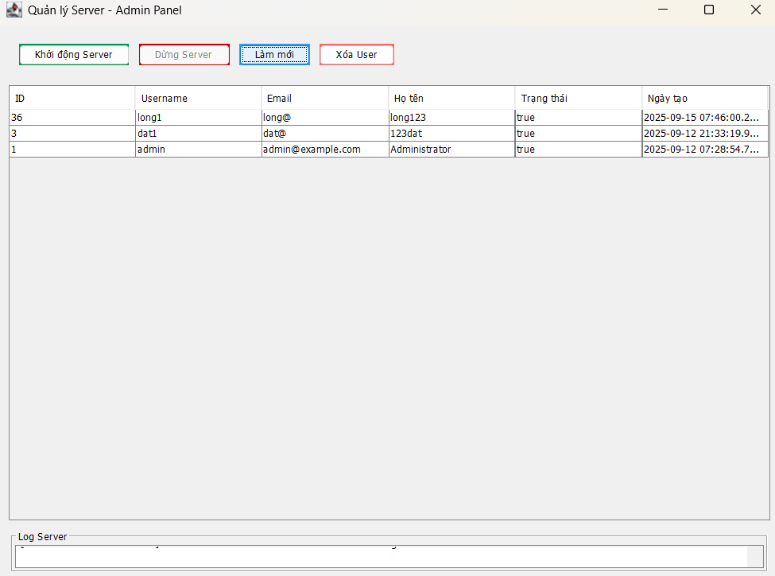
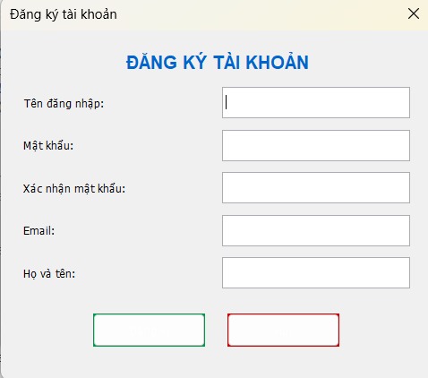
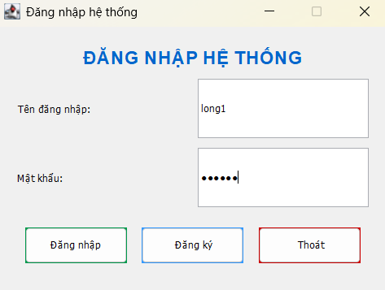
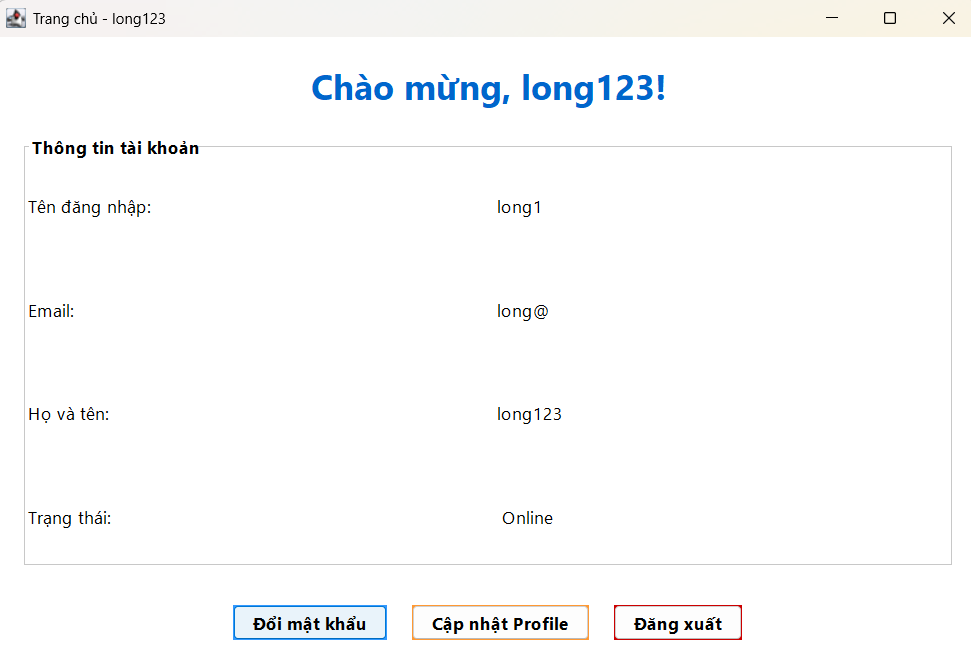
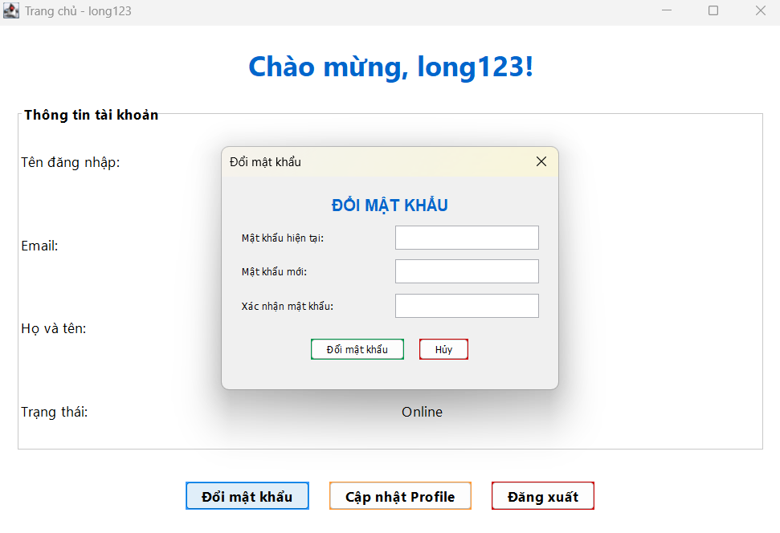
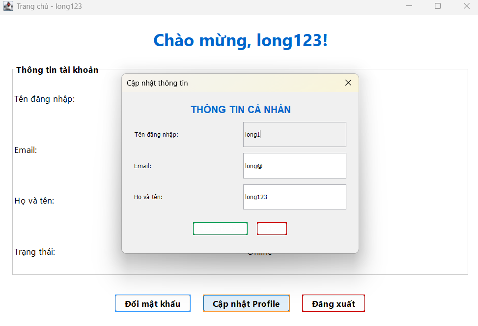

<h2 align="center">
    <a href="https://dainam.edu.vn/vi/khoa-cong-nghe-thong-tin">
    🎓 Faculty of Information Technology (DaiNam University)
    </a>
</h2>
<h2 align="center">
   Đăng nhập Client và Server
</h2>
<div align="center">
    <p align="center">
        
        
        
    </p>

[](https://www.facebook.com/DNUAIoTLab)
[](https://dainam.edu.vn/vi/khoa-cong-nghe-thong-tin)
[](https://dainam.edu.vn)

</div>

## 📖 1. Giới thiệu
<b>Hệ thống đăng nhập client-server </b>là một giải pháp phần mềm hiện đại được thiết kế để quản lý xác thực người dùng thông qua giao thức mạng TCP. Hệ thống này cung cấp một nền tảng bảo mật và ổn định cho việc đăng ký, đăng nhập và quản lý tài khoản người dùng.

Đề tài tập trung vào việc xây dựng một kiến trúc phân tán theo mô hình client-server, nơi máy chủ đóng vai trò trung tâm trong việc xử lý logic nghiệp vụ, quản lý cơ sở dữ liệu và đảm bảo tính bảo mật, trong khi client cung cấp giao diện người dùng trực quan và thân thiện.


## 🔧 2. Ngôn ngữ lập trình sử dụng: [](https://www.java.com/)

## 🚀 3. Hình ảnh chức năng

<p align="center">
  
</p>

<p align="center">
  <em>Hình 1: Giao diện Admin </em>
</p>

<p align="center">
  
</p>
<p align="center">
  <em> Hình 2: Giao diện Đăng ký</em>
</p>


<p align="center">
  
 
</p>
<p align="center">
  <em> Hình 3: Giao diện đăng nhập </em>
</p>

<p align="center">
    
</p>
<p align="center">
  <em> Hình 4: Giao diện chính người dùng</em>
</p>

<p align="center">
  
</p>
<p align="center">
  <em> Hình 5: Giao diện đổi mật khẩu</em>
</p>

<p align="center">
  
</p>
<p align="center">
  <em> Hình 6: Giao diện thay đổi thông tin cá nhân</em>
</p>
 
## 📝 4. Các bước cài đặt 

### 🔹 Bước 1: Cài đặt phần mềm cần thiết
- **Java Development Kit (JDK) 8+)**  
  - Tải từ https://www.oracle.com/java/technologies/javase-downloads.html hoặc https://jdk.java.net/  
  - Kiểm tra cài đặt:  
    ```bash
    java -version
    javac -version
    ```
- **PostgreSQL 12+**  
  - Tải từ https://www.postgresql.org/download/  
  - Cài đặt với cấu hình mặc định  
- **PostgreSQL JDBC Driver**  
  - Phiên bản khuyến nghị: **postgresql-42.6.0.jar**  
  - Tải tại https://jdbc.postgresql.org/download/  
  - Đặt file JAR cùng thư mục với source code  

---

### 🔹 Bước 2: Biên dịch source code

#### 🖥️ Trên Windows
```bash
javac -cp .;postgresql-42.6.0.jar Login/*.java
```
💻 Trên Linux/Mac
```bash
javac -cp .:postgresql-42.6.0.jar Login/*.java
```
🔹 Bước 3: Khởi động Server Admin
🖥️ Trên Windows
```bash
java -cp .;postgresql-42.6.0.jar Login.ServerAdminGUI
```
💻 Trên Linux/Mac
```bash
java -cp .:postgresql-42.6.0.jar Login.ServerAdminGUI
```
🔹 Bước 4: Khởi động Client
🖥️ Trên Windows
```bash
java -cp .;postgresql-42.6.0.jar Login.LoginGUI
```
💻 Trên Linux/Mac
```bash
java -cp .:postgresql-42.6.0.jar Login.LoginGUI
```

## 5. Liên hệ 
Nếu có bất kỳ thắc mắc hoặc cần hỗ trợ, vui lòng liên hệ:

📧 Email: datn32908@gmail.com
